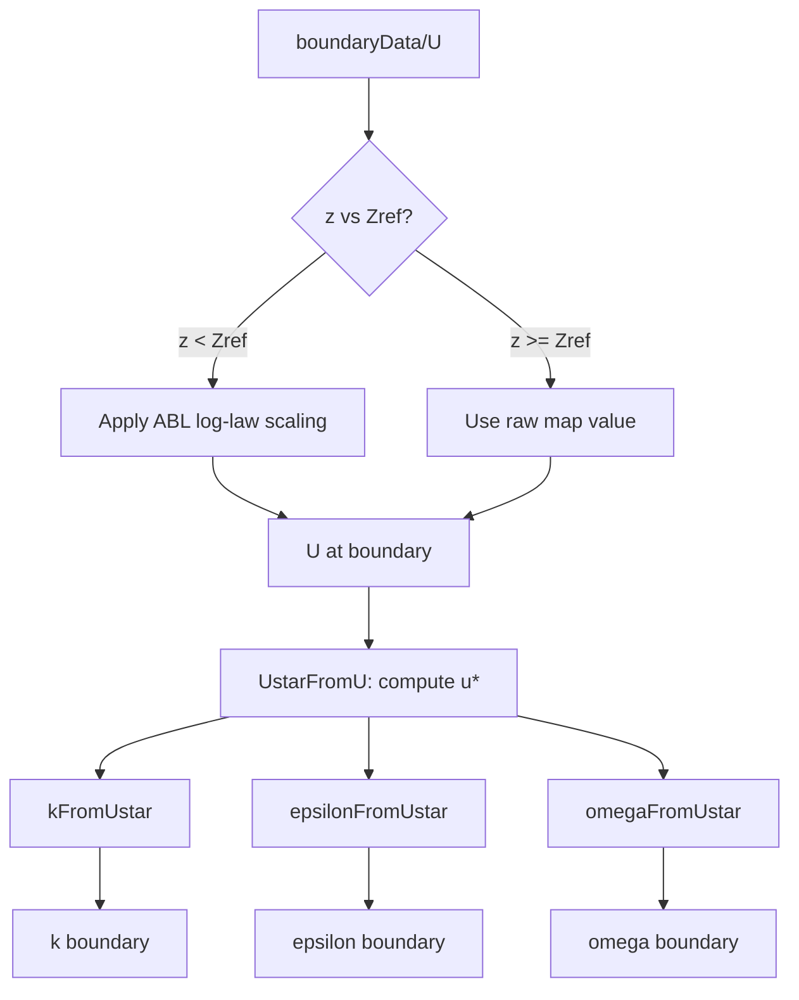
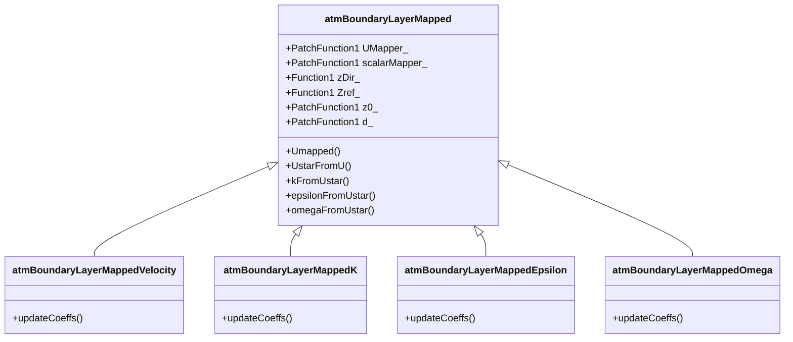

# atmBoundaryLayerMapped Suite

Atmospheric Boundary Layer Mapped Boundary Condition Suite - An inlet boundary condition implementation based on measured data for OpenFOAM.

## Overview

This suite is built on OpenFOAM 2112 and implements a set of strictly coupled mapping boundary conditions. The design principle is: **only U reads external data, k/ε/ω are computed from U using ABL formulas**, ensuring data consistency.

### Key Features

- **Strict Coupling**: k/ε/ω must be used together with `atmBoundaryLayerMappedVelocity`, otherwise an error is raised
- **Automatic Turbulence Calculation**: Compute u* from actual U values, then calculate k/ε/ω using ABL formulas
- **ABL Log-law Scaling**: U mapped data is scaled with log-law below Zref, and uses raw map values above Zref
- **Minimal Configuration**: k/ε/ω boundaries only need `type` and `phi`, other parameters are copied from U

## Data Flow



### U Boundary Condition Logic

| Height Range | Treatment | Description |
|--------------|-----------|-------------|
| $z < Z_{ref}$ | Apply ABL log-law scaling | Map U value multiplied by $\frac{\ln((z-d+z_0)/z_0)}{\ln((Z_{ref}+z_0)/z_0)}$ |
| $z \geq Z_{ref}$ | Use raw map value | No correction, preserve original mapped data |

## Calculation Formulas

### 1. Friction Velocity

$$u^* = \frac{\kappa \cdot U}{\ln((z - d + z_0)/z_0)}$$

Where:
- $\kappa$: von Kármán constant (default 0.41)
- $z$: height
- $d$: displacement height
- $z_0$: roughness length
- $U$: streamwise velocity component

### 2. Turbulent Kinetic Energy (k)

$$k = \frac{(u^*)^2}{\sqrt{C_\mu}} \cdot \sqrt{C_1 \cdot \ln((z-d+z_0)/z_0) + C_2}$$

### 3. Turbulent Dissipation Rate (ε)

$$\varepsilon = \frac{(u^*)^3}{\kappa \cdot z} \cdot \sqrt{C_1 \cdot \ln((z-d+z_0)/z_0) + C_2}$$

### 4. Specific Dissipation Rate (ω)

$$\omega = \frac{u^*}{\kappa \cdot \sqrt{C_\mu} \cdot z}$$

Default constants:
- $C_\mu = 0.09$
- $C_1 = 0.0$
- $C_2 = 1.0$

## User Setup

### 1. Prepare Boundary Data

Create `constant/boundaryData/<patchName>/` directory:

```bash
constant/boundaryData/East/
├── points              # Sampling point coordinates (required)
└── 0/
    └── U               # Velocity data (required)
```

**points file format:**
```cpp
// Points
3
(
(10 10 10)
(-10 10 10)
(10 -10 10)
)
```

**U file format:**
```cpp
// Data on points
3
(
(10 0 0)
(12 0 0)
(15 0 0)
)
```

### 2. Configure Boundary Conditions

#### 0/U (Required Configuration)

```cpp
boundaryField
{
    "(North|West|South|East)"
    {
        type            atmBoundaryLayerMappedVelocity;
        // ABL parameters
        zDir            (0 0 1);        // Vertical direction
        Zref            10;             // Reference height
        z0              uniform 1;      // Roughness length
        d               uniform 0;      // Displacement height
    }
}
```

#### 0/k, 0/epsilon, 0/omega (Minimal Configuration)

```cpp
boundaryField
{
    "(North|West|South|East)"
    {
        type            atmBoundaryLayerMappedK;  // or MappedEpsilon/MappedOmega
        // ABL parameters
        zDir            (0 0 1);        // Vertical direction
        Zref            10;             // Reference height
        z0              uniform 1;      // Roughness length
        d               uniform 0;      // Displacement height
    }
}
```

### 3. Load Library

Add to `system/controlDict`:

```cpp
libs ("libatmBoundaryLayerMapped.so");
```

### 4. Parameter Description

| Parameter | Required | Description |
|-----------|----------|-------------|
| `type` | Yes | Boundary type |
| `zDir` | Yes | Vertical direction vector |
| `Zref` | Yes | Reference height (m) |
| `z0` | Yes | Roughness length (m) |
| `d` | Yes | Displacement height (m) |
| `kappa` | No (0.41) | von Kármán constant |
| `Cmu` | No (0.09) | Model constant |
| `C1` | No (0.0) | ABL profile constant 1 |
| `C2` | No (1.0) | ABL profile constant 2 |

## Program Architecture

### Class Inheritance



### Key Functions

#### Base Class (atmBoundaryLayerMapped)

```cpp
// Get velocity from mapped data (with ABL log-law scaling below Zref)
tmp<vectorField> Umapped(const vectorField& pCf) const;

// Calculate friction velocity from actual U values
tmp<scalarField> UstarFromU(const vectorField& Uvalues, const vectorField& pCf) const;

// Calculate turbulence parameters from u*
tmp<scalarField> kFromUstar(const scalarField& uStar, const vectorField& pCf) const;
tmp<scalarField> epsilonFromUstar(const scalarField& uStar, const vectorField& pCf) const;
tmp<scalarField> omegaFromUstar(const scalarField& uStar, const vectorField& pCf) const;
```

#### Derived Class updateCoeffs Flow

**Velocity BC:**
```cpp
void updateCoeffs()
{
    // 1. Read raw U from boundaryData
    // 2. Apply ABL log-law scaling (only below Zref)
    refValue() = Umapped(patch().Cf());
    inletOutletFvPatchVectorField::updateCoeffs();
}
```

**K/Epsilon/Omega BC:**
```cpp
void updateCoeffs()
{
    // 1. Strict check: U must use atmBoundaryLayerMappedVelocity
    checkUCompatibility();
    
    // 2. Get U patch internal field (value copy)
    const vectorField Uvalues(Upatch.patchInternalField());
    
    // 3. Calculate friction velocity u*
    tmp<scalarField> uStar = UstarFromU(Uvalues, patch().Cf());
    
    // 4. Calculate turbulence parameters using ABL formulas
    refValue() = kFromUstar(uStar(), patch().Cf());
    
    inletOutletFvPatchScalarField::updateCoeffs();
}
```

### Safety Mechanisms

1. **Type Checking**: k/ε/ω boundaries strictly check U boundary type, error if mismatch
2. **Null Pointer Checking**: Base class functions check all Function1/PatchFunction1 initialization
3. **Value Copy**: Use `const vectorField Uvalues(...)` instead of reference to avoid memory issues

## Notes

1. **Coupled Usage**: k/ε/ω must be used with `atmBoundaryLayerMappedVelocity` on the same patch
2. **Data Consistency**: Only U reads external data, turbulence parameters are calculated via formulas to ensure consistency with U
3. **Flow Direction**: Flow direction is automatically calculated from the average direction of mapped U, no manual specification needed
4. **Boundary Data**: Only U boundaryData is required, k/ε/ω do not need data files

## File List

```
atmBoundaryLayerMapped/
├── atmBoundaryLayerMapped/
│   ├── atmBoundaryLayerMapped.H          # Base class declaration
│   └── atmBoundaryLayerMapped.C          # Base class implementation
├── atmBoundaryLayerMappedVelocity/
│   ├── atmBoundaryLayerMappedVelocityFvPatchVectorField.H
│   └── atmBoundaryLayerMappedVelocityFvPatchVectorField.C
├── atmBoundaryLayerMappedK/
│   ├── atmBoundaryLayerMappedKFvPatchScalarField.H
│   └── atmBoundaryLayerMappedKFvPatchScalarField.C
├── atmBoundaryLayerMappedEpsilon/
│   ├── atmBoundaryLayerMappedEpsilonFvPatchScalarField.H
│   └── atmBoundaryLayerMappedEpsilonFvPatchScalarField.C
├── atmBoundaryLayerMappedOmega/
│   ├── atmBoundaryLayerMappedOmegaFvPatchScalarField.H
│   └── atmBoundaryLayerMappedOmegaFvPatchScalarField.C
├── Make/
│   ├── files
│   └── options
└── README.md
```
