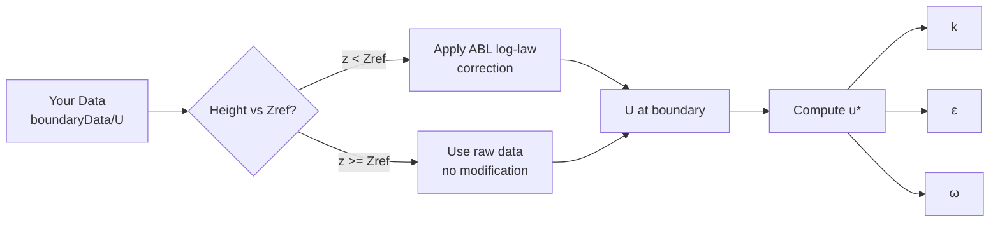
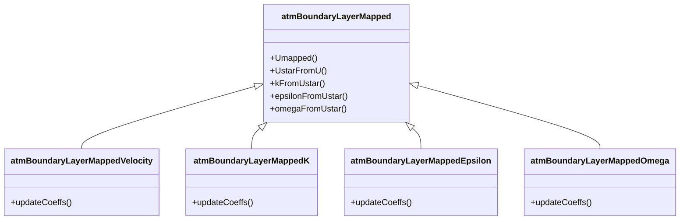

# atmBoundaryLayerMapped Suite

Atmospheric Boundary Layer Mapped Boundary Condition Suite for OpenFOAM.

## Introduction

### Why This Boundary Condition?

When performing wind simulations around buildings or urban areas using measured data on scattered points or from upstream simulators like WRF, the standard approaches have limitations:

1. **Standard `timeVaryingMappedFixedValue`**: Directly maps data without considering atmospheric boundary layer physics. The near-ground velocity profile doesn't follow the log-law, causing unphysical results.

2. **Standard `atmBoundaryLayerInletVelocity`**: Uses theoretical ABL profiles, but only has limited support for mapping.

**This BC combines the best of both worlds**: Use your mapped data while applying ABL log-law correction where appropriate.

### How It Works



| Height           | Treatment           | Rationale                                                            |
| ---------------- | ------------------- | -------------------------------------------------------------------- |
| $z < Z_{ref}$    | ABL log-law scaling | Near-ground: measurements may not capture true surface layer physics |
| $z \geq Z_{ref}$ | Raw mapped data     | Above reference height: your data is reliable, preserve it           |

### Key Features

- **Hybrid approach**: ABL correction below Zref, raw data above Zref
- **Automatic turbulence**: k/ε/ω calculated from U using ABL formulas — no separate data files needed
- **Strict coupling**: k/ε/ω BCs require `atmBoundaryLayerMappedVelocity` on U — prevents configuration errors
- **Inlet/outlet capable**: Based on `inletOutlet` — handles backflow gracefully

---

## Quick Start

### Step 1: Prepare Your Data

Create boundary data directory with your measured/simulated velocity:

```bash
constant/boundaryData/East/
├── points      # Sampling point coordinates
└── 0/
    └── U       # Velocity vectors at those points
```

**points** — 3D coordinates of your measurement/sampling locations:

```cpp
// Points
3
(
(10 10 10)
(-10 10 10)
(10 -10 10)
)
```

**U** — Velocity vectors (same order as points):

```cpp
// Data on points
3
(
(10 0 0)
(12 0 0)
(15 0 0)
)
```

### Step 2: Configure Boundary Conditions

**0/U:**

```cpp
boundaryField
{
    inlet
    {
        type    atmBoundaryLayerMappedVelocity;
        zDir    (0 0 1);        // Vertical direction
        Zref    10;             // Reference height [m]
        z0      uniform 1;      // Roughness length [m]
        d       uniform 0;      // Displacement height [m]
    }
}
```

**0/k, 0/epsilon, 0/omega:**

```cpp
boundaryField
{
    inlet
    {
        type    atmBoundaryLayerMappedK;  // or MappedEpsilon / MappedOmega
        zDir    (0 0 1);
        Zref    10;
        z0      uniform 1;
        d       uniform 0;
    }
}
```

> ⚠️ **Note**: k/ε/ω BCs must be used with `atmBoundaryLayerMappedVelocity` for U. An error will be raised if U uses a different BC type.

### Step 3: Load the Library

Add to `system/controlDict`:

```cpp
libs ("libatmBoundaryLayerMapped.so");
```

### Step 4: Run

```bash
# Compile the library (first time only)
cd path/to/atmBoundaryLayerMapped
wmake

# Run your case
cd your/case
simpleFoam
```

### Parameters

| Parameter | Required | Default | Description                  |
| --------- | -------- | ------- | ---------------------------- |
| `zDir`    | Yes      | —       | Vertical direction vector    |
| `Zref`    | Yes      | —       | Reference height [m]         |
| `z0`      | Yes      | —       | Surface roughness length [m] |
| `d`       | Yes      | —       | Displacement height [m]      |
| `kappa`   | No       | 0.41    | von Kármán constant          |
| `Cmu`     | No       | 0.09    | Turbulence model constant    |
| `C1`      | No       | 0.0     | ABL profile coefficient      |
| `C2`      | No       | 1.0     | ABL profile coefficient      |

---

## Technical Reference

### U Boundary: Zref-Based Logic

For $z < Z_{ref}$:

$$
U(z) = U_{mapped} \cdot \frac{\ln((z-d+z_0)/z_0)}{\ln((Z_{ref}+z_0)/z_0)}
$$

For $z \geq Z_{ref}$:

$$
U(z) = U_{mapped}
$$

### Friction Velocity

$$
u^* = \frac{\kappa \cdot U}{\ln((z - d + z_0)/z_0)}
$$

### Turbulence Parameters

**Turbulent Kinetic Energy:**

$$
k = \frac{(u^*)^2}{\sqrt{C_\mu}} \cdot \sqrt{C_1 \cdot \ln((z-d+z_0)/z_0) + C_2}
$$

**Dissipation Rate:**

$$
\varepsilon = \frac{(u^*)^3}{\kappa \cdot z} \cdot \sqrt{C_1 \cdot \ln((z-d+z_0)/z_0) + C_2}
$$

**Specific Dissipation Rate:**

$$
\omega = \frac{u^*}{\kappa \cdot \sqrt{C_\mu} \cdot z} 
$$

### Architecture



### Update Flow

**Velocity BC:**

```cpp
refValue() = Umapped(patch().Cf());  // Apply Zref-based logic
```

**Turbulence BCs (k/ε/ω):**

```cpp
Uvalues = Upatch.patchInternalField();  // Get internal field U
uStar = UstarFromU(Uvalues, pCf);       // Compute friction velocity
refValue() = kFromUstar(uStar, pCf);    // Compute k (or ε/ω)
```

### File Structure

```
atmBoundaryLayerMapped/
├── atmBoundaryLayerMapped/
│   ├── atmBoundaryLayerMapped.H
│   └── atmBoundaryLayerMapped.C
├── atmBoundaryLayerMappedVelocity/
│   ├── atmBoundaryLayerMappedVelocityFvPatchVectorField.H
│   └── atmBoundaryLayerMappedVelocityFvPatchVectorField.C
├── atmBoundaryLayerMappedK/
│   ├── atmBoundaryLayerMappedKFvPatchScalarField.H
│   └── atmBoundaryLayerMappedKFvPatchScalarField.C
├── atmBoundaryLayerMappedEpsilon/
│   ├── atmBoundaryLayerMappedEpsilonFvPatchScalarField.H
│   └── atmBoundaryLayerMappedEpsilonFvPatchScalarField.C
├── atmBoundaryLayerMappedOmega/
│   ├── atmBoundaryLayerMappedOmegaFvPatchScalarField.H
│   └── atmBoundaryLayerMappedOmegaFvPatchScalarField.C
└── Make/
    ├── files
    └── options
```
